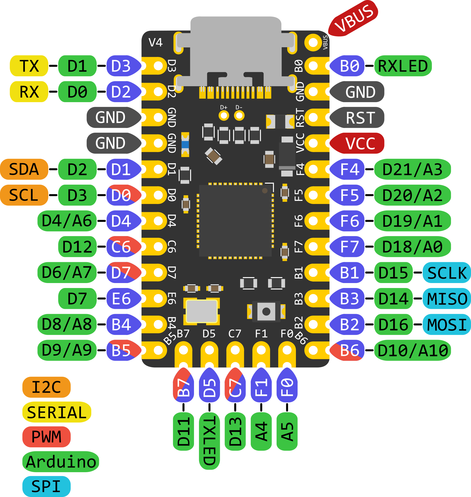

# Elite-C XInput Controller

DIY XInput controller using an Elite-C microcontroller board. The Elite-C is mostly used for custom keyboards and flashing with QMK, but the ATmega32U4 and the 6 additional I/O pins make this a great target for a a complete XInput controller board that doesn't require shift registers or GPIO expanders.

## Pin Mapping

The Elite-C is labelled with the port pins instead of typical Arduino pin numbering. Here is the mapping:

| XInput Button | Port Pin | Analog |
| ------------- | -------- | ------ |
| Dpad Up       | PB1      | No     |
| Dpad Down     | PB3      | No     |
| Dpad Left     | PB2      | No     |
| Dpad Right    | PB6      | No     |
| A             | PD7      | No     |
| B             | PE6      | No     |
| X             | PB4      | No     |
| Y             | PB5      | No     |
| Back          | PD3      | No     |
| Start         | PD2      | No     |
| Left Bumper   | PB7      | No     |
| Right Bumper  | PB0      | No     |
| Left Trigger  | PF1      | Yes    |
| Right Trigger | PF0      | Yes    |
| L3            | PD4      | No     |
| R3            | PC6      | No     |
| Home/Logo     | PC7      | No     |
| Left Stick X  | PF4      | Yes    |
| Left Stick Y  | PF5      | Yes    |
| Right Stick X | PF6      | Yes    |
| Right Stick Y | PF7      | Yes    |

## TODOs

* Implement analog reads for sticks and triggers
* Optimize loop logic
* Document build and flash steps
* Create boards repo for Elite-C
* Latency testing
