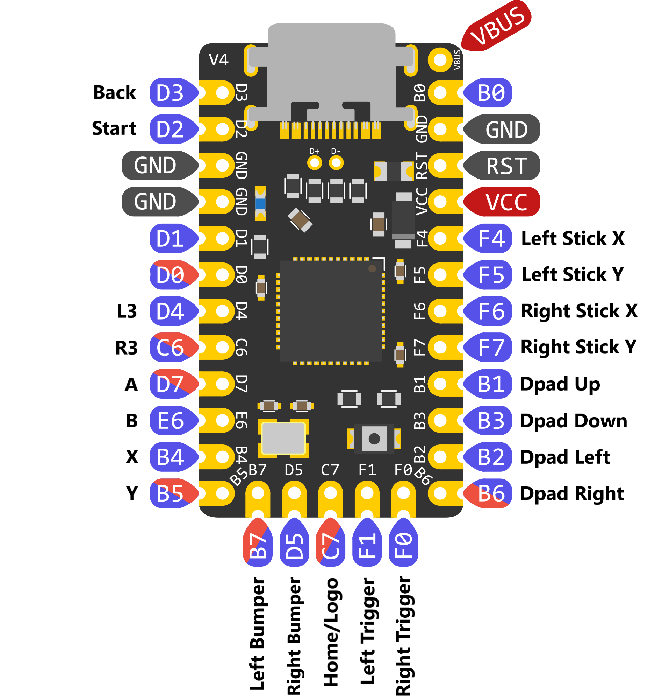

# Elite-C XInput Controller

DIY XInput controller using an Elite-C microcontroller board.

A full XInput controller implementation requires a total of 21 pins on the MCU board (15 digital inputs, 6 analog inputs), however the common Pro Micro variants only contain 18 usable pins, and up to 20 with some modifications. The Elite-C provides a USB-C interface and 24 usable pins. That is enough to cover each input without using shift registers or GPIO expanders while also leaving 3 available pins for other purposes.

Three prebuilt binaries are available:

* ECX Digital Controller - This build includes only the bare necessities for a working digital gamepad or arcade stick, and as such is also the fastest available binary (see the [Performance section](#performance) for details).
* ECX Pro Controller - Like the `ECX Digital Controller`, plus analog left and right joysticks.
* ECX Elite Controller - Contains all available inputs, using analog joysticks and triggers.

## Performance

I've measured the performance of this sketch using the methodology outlined at [WydD's outstanding inputlag.science website](https://inputlag.science/controller/methodology). The detailed results can be found in the [Elite-C Controller Input Lag spreadsheet](https://docs.google.com/spreadsheets/d/1yfBr1uXyzMTwqz8_qHCONQ1BwaxIcIZJ1_DqN0GXziE). Here are the important bits:

| Metric    | Digital | Pro     | Elite   |
| --------- | ------- | ------- | ------- |
| polling   | 1ms     | 1ms     | 1ms     |
| min       | 0.55ms  | 1.20ms  | 1.46ms  |
| max       | 1.74ms  | 2.97ms  | 4.78ms  |
| avg       | 0.98ms  | 2.04ms  | 2.55ms  |
| stdev     | 0.30ms  | 0.34ms  | 0.59ms  |
| % on time | 95.11%  | 86.04%  | 85.70%  |
| %1f skip  | 4.89%   | 13.96%  | 14.30%  |
| %2f skip  | 0%      | 0%      | 0%      |

## Installation

### Pin Mapping

The Elite-C is labelled with the port pins instead of typical Arduino pin numbering. Here is the mapping:



| XInput Button | Port Pin | Analog |   | XInput Button | Port Pin | Analog |
| ------------- | -------- | ------ | - | ------------- | -------- | ------ |
| Dpad Up       | PB1      | No     |   | Left Stick X  | PF4      | Yes    |
| Dpad Down     | PB3      | No     |   | Left Stick Y  | PF5      | Yes    |
| Dpad Left     | PB2      | No     |   | Right Stick X | PF6      | Yes    |
| Dpad Right    | PB6      | No     |   | Right Stick Y | PF7      | Yes    |
| A             | PD7      | No     |   | Left Bumper   | PB7      | No     |
| B             | PE6      | No     |   | Right Bumper  | PD5      | No     |
| X             | PB4      | No     |   | Left Trigger  | PF1      | Yes    |
| Y             | PB5      | No     |   | Right Trigger | PF0      | Yes    |
| Back          | PD3      | No     |   | L3            | PD4      | No     |
| Start         | PD2      | No     |   | R3            | PC6      | No     |
| Home/Logo     | PC7      | No     |

### Wiring

Wire up each pin to a switch leg, and the other switch leg to ground. For builds supporting analog controls, wire up VCC to the reference voltage of the potentiometer/joystick, ground to ground, and the signal lines to the designated pins.

## Binaries

### Prebuilt Binaries

You will need Atmel FLIP or AVRDUDE in order to flash this program to your Elite-C MCU. Download the ECX Controller `.hex` file for the version you want to use. Then follow the steps below:

#### Flashing with Atmel FLIP

1. Bridge the RESET pin on the Elite-C to ground to put the MCU into DFU mode.
1. Select `ATmega32U4` in the Device Selection.
1. Connect via USB by clicking the USB cable icon and selecting USB, or pressing `Ctrl+U` on your keyboard.
1. Go to `File > Load Hex File` and select the `.hex` you downloaded.
1. Click `Run`. FLIP should perform the operations in the Operations Flow box.
1. Once complete, click the `Start Application` (uncheck Reset option) to run the XInput program.

#### Flashing with AVRDUDE

If you have Arduino IDE installed, you can use the version included in the `hardware\tools\avr\bin` folder, and point to the `avrdude.conf` file located in the `hardware\tools\avr\etc` path of your Arduino IDE installation.

1. Bridge the RESET pin on the Elite-C to ground to put the MCU into DFU mode.
1. Open a command line and run the following, replacing `[path-to-elitec-hex]` with the path to the `.hex` file you downloaded:

```sh
avrdude -C avrdude.conf -c flip1 -p atmega32u4 -U "flash:w:[path-to-elitec-hex]:i" -P usb -v -u
```

AVRDUDE will not run the program after flashing, so just power cycle the Elite-C or use Atmel FLIP to start it up.

### Build Your Own

This one requires a bit of setup, so I suggest you use a prebuilt binary unless you want to add some options or features.

#### Dependencies

Using Arduino IDE, make sure you have the following packages installed:

* [Arduino XInput Library](https://github.com/dmadison/ArduinoXInput)
* [SSD1306 Display Driver](https://github.com/lexus2k/ssd1306) (only for debug builds)

You will need to manually install a few packages to your Arduino IDE `hardware` folder:

* [XInput USB Core for Arduino AVR](https://github.com/dmadison/ArduinoXInput_AVR)
* [Elite-C Board w/XInput](https://github.com/jskuby/ArduinoXInput_EliteC)

#### Tweaks

If you want 1000Hz polling rate instead of the default 250Hz, you will need to manually change the `hardware\xinput\avr\cores\arduino\xinput\USB_XInput_Descriptors.cpp` file. Open in a text editor and find the section:

```cpp
  // Endpoint 1: Control Surface Send
  0x07,        // bLength
  0x05,        // bDescriptorType (ENDPOINT)
  0x81,        // bEndpointAddress (IN, 1)
  0x03,        // bmAttributes
  0x20, 0x00,  // wMaxPacketSize
  0x04,        // bInterval
```

Change the last hex value (commented with `bInterval`) to `0x01`:

```cpp
  // Endpoint 1: Control Surface Send
  0x07,        // bLength
  0x05,        // bDescriptorType (ENDPOINT)
  0x81,        // bEndpointAddress (IN, 1)
  0x03,        // bmAttributes
  0x20, 0x00,  // wMaxPacketSize
  0x01,        // bInterval
```

#### Building/Uploading the Sketch

Once that's all set up, download this repository then open the `elitec_xinput_controller.ino` file in your Arduino IDE. From there:

1. Open the `Tools > Board` menu. You should now see an `Elite-C w/XInput` option. Select that board.
1. You may ignore the Port selection even if one is already selected, as this will be ignored.
1. Put the Elite-C into DFU mode by bridging RESET to ground once.
1. You should now be able to compile and upload the sketch via Arduino IDE.

Changing a few `define` values at the top of the sketch will give you the various prebuilt versions:

* ECX Digital Controller - `USE_JOYSTICKS 0` and `USE_ANALOG_TRIGGERS 0`, leaves 7 free I/O pins
* ECX Pro Controller - `USE_JOYSTICKS 1` and `USE_ANALOG_TRIGGERS 0`, leaves 3 free I/O pins
* ECX Elite Controller - `USE_JOYSTICKS 1` and `USE_ANALOG_TRIGGERS 1`, leaves 3 free I/O pins

> NOTE: I haven't found a way to get AVRDUDE to run the program after flashing, so you'll need to power cycle the Elite-C or use Atmel FLIP to run the program.

## Optimizations

Just wanted a place to document the steps that have been taken to reduce the loop logic runtime, and in turn, input latency:

* **1000Hz/1ms polling rate** - Allows the controller to respond a few milliseconds faster than the stock 250Hz/4ms polling rate
* **Built with `-Ofast` optimization flag** - The program is much smaller and XInput operations run much faster with this or the `-O3` build flag set
* **Fast state checking** - A lightweight process handles checking for state changes, avoiding much of the overhead from the XInput library state checks
* **Conditional code inclusion** - Debug and options-based code are excluded from the final payload, the less code the better 😎

Some micro-optimizations have also been implemented:

* **Inline functions** - Used to avoid a few jumps and save some processing cycles
* **Avoid implicit conversions** - Any values that could normally be checked as "truthy" or implicitly converted are instead checked against explicit values, again saving precious cycles

## Hardware

Here's an example of how the board can be set up for easy wiring. This is my current dev board that consists of a [mini perma-proto board](https://www.amazon.com/gp/product/B085WPTQ9B), 2.54mm screw terminals and an I2C OLED for debugging. The Elite-C is directly soldered via the castellated pins and route to the screw terminals via the proto board rails:


## Caveats

The only compromise to be made is the ADC in the ATmega32U4 is only 10-bit, while the XInput joysticks are 16-bit, which results in reduced joystick resolution. This shouldn't be a problem in most cases, but may vary based on the game.

## TODOs

* Add LS/DP/RS stick emulation and selection options
* Dig into XInput library for optimization opportunities
* Other random micro-optimizations
